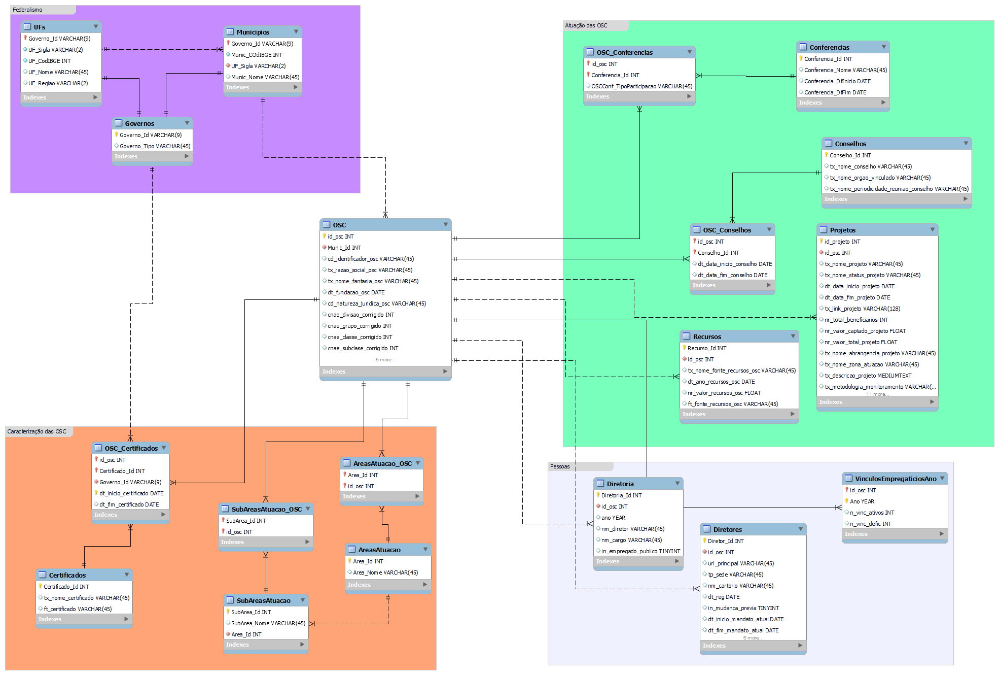

Reformulação do Mapa das Organizações da Sociedade Civil (IPEA)
================

**Murilo Junqueira** (<m.junqueira@yahoo.com.br>)

### Objetivo do Projeto:

Demonstrar um modelo de reformulação dos dados atualmente disponíveis no
[Mapa das Organizações da Sociedade Civil
(OSC)](https://mapaosc.ipea.gov.br/).

### Os passos dessa reformulação são:

1.  Mapeamento das Bases Originais que compõem o Mapa
2.  Criação de um novo *schema* dos dados, representado por um diagrama
    entidade-relacionamento (DER)
3.  Validação do *schema* junto à direção do IPEA.
4.  Formatação dos dados originais no novo *schema*.
5.  Migração dos dados para, para um DBMS (*Data Base Management
    System*), PostgreSQL ou MySQL.
6.  Criação da documentação completa do banco, incluindo o fluxo
    administrativo.

Essa página visa descrever como se dá os passos 2 e 4, utilizando as
bases atualmente disponíveis no site [Site do Mapa das
(OSC)](https://mapaosc.ipea.gov.br/base-dados).

Os demais passos não são possíveis de serem feitos no momento.

### Definição de um novo *schema* para o Mapa das OSC

Com base nos dados disponíveis no [Mapa das
(OSC)](https://mapaosc.ipea.gov.br/base-dados), na aba “Dados \> Base de
dados”, elaboramos o seguinte modelo de dados:

#### Diagrama Entidade-Relacionamento (DER):

<figure>

<figcaption aria-hidden="true">Entity-relationship diagram</figcaption>
</figure>

A figura do *schema* acima, em tamanho expandido, pode ser encontrada na
pasta “data/metadata/dataModel_MySQL/” deste repositório.

A criação deste modelo de dados foi feita com o princípio de reduzir ao
máximo a redundância dos dados (processo de “normalização” das bases de
dados), de modo a que cada informação apareça apenas uma vez. Abaixo
explicamos o significado de cada uma das tabelas e das conexões feitas.

#### Explicação do Diagrama Entidade-Relacionamento:

A tabela mais central do banco é a tabela **OSC**, que guarda os dados
básicos das Organizações da Sociedade Civil. Suas variáveis são:

- Tabela **OSC:**
  - **id_osc:** (chave-primária) identificação da OSC.
  - **Munic_Id:** código IBGE do município da sede da OSC.
  - **cd_identificador_osc:** outro número de indentificação das OSC.
  - **tx_razao_social_osc:** razão social da OSC.
  - **tx_nome_fantasia_osc:** nome fantasia da OSC.
  - **dt_fundacao_osc:** data de fundação da OSC.
  - **cd_natureza_juridica_osc:** natureza jurídica da OSC.
  - **cnae_divisao_corrigido:** divisão da CNAE que se encontra a OSC.
  - **cnae_grupo_corrigido:** grupo da CNAE.
  - **cnae_classe_corrigido:** classe da CNAE.
  - **cnae_subclase_corrigido:** sub-classe da CNAE.
  - **endereco:** endereço oficial da OSC.
  - **bairro:** bairro.
  - **macro_area_atuacao:** macro área de atuação da OSC.
  - **micro_area_atuacao:** micro área de atuação da OSC.

Na região noroeste do DER acima estão algumas tabelas destinadas a
guardas dados sobre as regiões administrativas brasileiras, ou seja, os
entes federativos. Optamos por criar uma tabela genérica “Governos” para
agregar todos os níveis federativos, dos municípios ao governo federal.
Isso é necessário porque em algumas tabelas a OSC pode ter atributos de
qualquer nível federativo. Por exemplo, ela pode ter um certificado
municipal (ex: Conselho Municipal de Assistência Social), mas também
pode ter um certificado estadual (ex: do Conselho Estadual de
Assistência Social ou de Saúde) e também do governo federal (ex:
Ministério da Justiça). O mesmo ocorre quanto a entidade tem assento em
conselhos de políticas públicas: ela pode ter acento em conselhos de
qualquer nível federativo. Então, criar colunas próprias para cada um
dos níveis federativos não é conveniente. Com a tabela intermediária
“Governos”, podemos criar a relação apenas com essa tabela. Para manter
a consistência e conexão nos dados, criamos duas relações “de um para
um” (1:1) entre as tabelas “Governos” e “Municipios”, bem como entre as
tabelas “Governos” e “UFs”. Em termos lógicos, podemos ler o seguinte:
alguns governos são municípios, mas não todos; da mesma forma, alguns
governos são Estados, mas não todos. Existe, inclusive o caso de dois
governos que não são nem Estados nem Municípios: o governo federal e o
Distrito Federal.

- Tabela **UFs:**
  - **Governo_Id:** (chave-primária) Identificação das unidades
    federativas.
  - **UF_Sigla:** sigla das UFs (ex: GO, ES).
  - **UF_CodIBGE:** código IBGE das UFs.
  - **UF_Nome:** nome da UF.
  - **UF_Regiao:** sigla da região da UF (ex: N, NE, CE, SE, S).
      
- Tabela **Municipios:**
  - **Governo_Id:** (chave-primária) identificação dos municípios.
  - **Munic_COdIBGE:** código IBGE dos municípios.
  - **UF_Sigla:** (chave-estrangeira) sigla do Estado do município.
  - **Munic_Nome:** nome do município.   
- Tabela **Governos:**
  - **Governo_Id:** (chave-primária) identificação dos governos.
  - **Governo_Tipo:** o tipo de governo (município, estado, DF ou União)
      

Na região sudoeste do mapa existe uma série de tabelas de caracterização
das OSC. A primeira são os certificados que a organização possui. Como
mencionado acima, cada certificado foi dado por um governo (que pode ser
a União, Estado ou Município). A tabela *Certificados* fala sobre as
características intrínsecas de cada certificado, mas não fala qual OSC
possui cada certificado. Isso é feito na tabela *OSC_Certificados*, que
estabelece uma relação “de muitos para muitos” (m:n) entre *OSC* e
*Certificados*. Os certificados possuem validade, que está guardado nas
variáveis *dt_inicio_certificado* e *dt_fim_certificado*.

- Tabela **Certificados:**
  - **Certificado_Id:** (chave-primária) indentificação do certificado.
  - **tx_nome_certificado:** nome do certificado.
  - **ft_certificado:** órgão que atribui o certificado.   
- Tabela **OSC_Certificados:**
  - **id_osc:** (chave-primária) identificação da OSC.
  - **Certificado_Id:** (chave-primária) indentificação do certificado.
  - **Governo_Id:** (chave-estrangeira) governo que atribuiu o
    certificado.
  - **dt_inicio_certificado:** (chave-primária) data de início do
    certificado.
  - **dt_fim_certificado:** data de fim do certificado   

Ainda na região sudoeste do DER…

- Tabela **AreasAtuacao:**
  - **Area_Id:**
  - **Area_Nome:**   
- Tabela **AreasAtuacao_OSC:**
  - **Area_Id:**
  - **id_osc:**   
- Tabela **SubAreasAtuacao:**
  - **SubArea_Id:**
  - **SubArea_Nome:**
  - **Area_Id:**   
- Tabela **SubAreasAtuacao_OSC:**
  - **SubArea_Id:**
  - **id_osc:**   
- Tabela **Conferencias:**
  - **Conferencia_Id:**
  - **Conferencia_Nome:**
  - **Conferencia_DtInicio:**
  - **Conferencia_DtFim:**   
- Tabela **OSC_Conferencias:**
  - **id_osc:**
  - **Conferencia_Id:**
  - **OSCConf_TipoParticipacao:**   
- Tabela **Conselhos:**
  - **Conselho_Id:**
  - **tx_nome_conselho:**
  - **tx_nome_orgao_vinculado:**
  - **tx_nome_periodicidade_reuniao_conselho:**   
- Tabela **OSC_Conselhos:**
  - **id_osc:**
  - **Conselho_Id:**
  - **dt_data_inicio_conselho:**
  - **dt_data_fim_conselho:**   
- Tabela **Projetos:**
  - **id_projeto:**
  - **id_osc:**
  - **tx_nome_projeto:**
  - **dt_data_inicio_projeto:**
  - **dt_data_fim_projeto:**
  - **tx_link_projeto:**
  - **nr_total_beneficiarios:**
  - **nr_valor_captado_projeto:**
  - **nr_valor_total_projeto:**
  - **tx_nome_abrangencia_projeto:**
  - **tx_nome_zona_atuacao:**
  - **tx_descricao_projeto:**
  - **tx_metodologia_monitoramento:**
  - **tx_status_projeto_outro:**
  - **tx_nome_financiador:**
  - **tx_orgao_concedente:**
  - **tx_nome_origem_fonte_recursos_projeto:**
  - **tx_nome_fonte_recursos_projeto:**
  - **tx_nome_regiao_localizacao_projeto:**
  - **tx_nome_objetivo_projeto:**
  - **tx_nome_meta_projeto:**
  - **tx_nome_publico_beneficiado:**
  - **nr_estimativa_pessoas_atendidas:**
  - **tx_nome_tipo_parceria:**   
- Tabela **Recursos:**
  - **Recurso_Id:**
  - **id_osc:**
  - **tx_nome_fonte_recursos_osc:**
  - **dt_ano_recursos_osc:**
  - **nr_valor_recursos_osc:**
  - **ft_fonte_recursos_osc:**   
- Tabela **Diretoria:**
  - **Diretoria_Id:**
  - **id_osc:**
  - **ano:**
  - **nm_diretor:**
  - **nm_cargo:**
  - **in_empregado_publico:**   
- Tabela **Diretores:**
  - **Diretor_Id:**
  - **url_principal:**
  - **tp_sede:**
  - **nm_cartorio:**
  - **dt_reg:**
  - **in_mudanca_previa:**
  - **dt_inicio_mandato_atual:**
  - **dt_fim_mandato_atual:**
  - **nm_diretor:**
  - **nm_ocupacao:**
  - **nm_genero:**
  - **in_empregado_publico:**
  - **in_funcao_remunerada:**
  - **nm_funcao_remunerada:**   
- Tabela **VinculosEmpregaticiosAno:**
  - **id_osc:**
  - **Ano:**
  - **n_vinc_ativos:**
  - **n_vinc_defic:**
